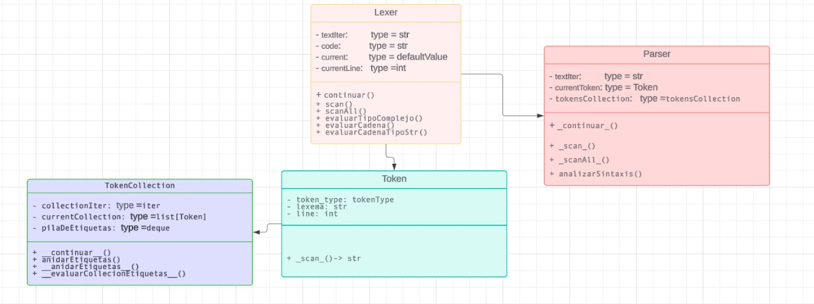

# PARSERANDO XML
Programa para de procesamineto de archivo XML a travez de un lexer (./lexer.py) y un parser (./Parser.py)

## Inicialización del programa
```
env\Scripts\activate

py .
```
## Estructuras de archivos de programa
- \_\_main\_\_.py (Archivo de inicialización del programa)
- .gitignoe (Exepcion de seguimiento de cambios de git)
- ASIGNACION.md (Indicaciones de la asignación)
- Estructura.xml (Archivo xml que el programa va a leer)
- Lexer.py (Contiene la clase Lexer)
- Parser.py (Contiene la clase Parser)
- Token.py (Contiene la clase Token y TokenTypes)
- TokensCollection.py (Contiene la clase TokenCollection)

## Funcionamiento del programa:
1. Se leer el archivo Estructura.xml y se pasa a String
2. Se crea una instancia de la clase parser con el texto del xml
3. La clase parser hace uso de la clase lexer que identifica cada uno de los tokens y lexemas como:
    - APERTURA_DE_ETIQUETA
    - NOMBRE_DE_ETIQUETA
    - CIERRE_DE_ETIQUETA
4. El parser se encarga de agrupar todos estos tokens en collecciones que represetan una etiqueta con la cantidad de atriburos que pueda contener, al igual que valida que se respete la coherencia del orden como se define una etiqueta

5. El parser hace un proceso de verificación de Anidamientos con el uso de la clase TokenCollection a travez de una estructura de pilas

Cualquier Error lexico o sintactico se vera reflejado en el primer resultado del programa

## APLICACION DE POO

El programa hacer uso de las clases Token, Lexer, Parser y TokensCollection con sus respectivos atributos y metodos

- En la clase TokensCollection se puede evidenciar polimorfismo en sus metodos anidarEtiquetas y \_\_anidarEtiquetas\_\_


## SALIDA ESPERADA DEL PROGRAMA
```
Colleccion 1:
tokenType.APERTURA_DE_ETIQUETA(<) - line(1)
tokenType.NOMBRE_DE_ETIQUETA(xsd:schema) - line(1)
tokenType.CADENA(xmlns:xsd) - line(2)
tokenType.ASIGNACION(=) - line(2)
tokenType.CADENA_DE_TEXTO_TIPO_STRING("http://www.w3.org/2001/XMLSchema") - line(2)
tokenType.CIERRE_DE_ETIQUETA(>) - line(2)
Colleccion 2:
tokenType.APERTURA_DE_ETIQUETA(<) - line(3)
tokenType.NOMBRE_DE_ETIQUETA(xsd:element) - line(3)
tokenType.CADENA(name) - line(3)
tokenType.ASIGNACION(=) - line(3)
tokenType.CADENA_DE_TEXTO_TIPO_STRING("purchaseOrder") - line(3)
tokenType.CADENA(type) - line(4)
tokenType.ASIGNACION(=) - line(4)
tokenType.CADENA_DE_TEXTO_TIPO_STRING("PurchaseOrderType") - line(4)        
tokenType.CIERRE_ESPECIAL_DE_ETIQUETA(/>) - line(4)
Colleccion 3:
tokenType.APERTURA_DE_ETIQUETA(<) - line(5)
tokenType.NOMBRE_DE_ETIQUETA(xsd:element) - line(5)
tokenType.CADENA(name) - line(5)
tokenType.ASIGNACION(=) - line(5)
tokenType.CADENA_DE_TEXTO_TIPO_STRING("comment") - line(5)
tokenType.CADENA(type) - line(5)
tokenType.ASIGNACION(=) - line(5)
tokenType.CADENA_DE_TEXTO_TIPO_STRING("xsd:string") - line(5)
tokenType.CIERRE_ESPECIAL_DE_ETIQUETA(/>) - line(5)
Colleccion 4:
tokenType.APERTURA_DE_ETIQUETA(<) - line(6)
tokenType.NOMBRE_DE_ETIQUETA(xsd:complexType) - line(6)
tokenType.CADENA(name) - line(6)
tokenType.ASIGNACION(=) - line(6)
tokenType.CADENA_DE_TEXTO_TIPO_STRING("PurchaseOrderType") - line(6)        
tokenType.CIERRE_DE_ETIQUETA(>) - line(6)
Colleccion 5:
tokenType.APERTURA_DE_ETIQUETA(<) - line(7)
tokenType.NOMBRE_DE_ETIQUETA(xsd:sequence) - line(7)
tokenType.CIERRE_DE_ETIQUETA(>) - line(7)
Colleccion 6:
tokenType.APERTURA_DE_ETIQUETA(<) - line(8)
tokenType.NOMBRE_DE_ETIQUETA(xsd:element) - line(8)
tokenType.CADENA(name) - line(8)
tokenType.ASIGNACION(=) - line(8)
tokenType.CADENA_DE_TEXTO_TIPO_STRING("shipTo") - line(8)
tokenType.CADENA(type) - line(8)
tokenType.ASIGNACION(=) - line(8)
tokenType.CADENA_DE_TEXTO_TIPO_STRING("Address") - line(8)
tokenType.CIERRE_ESPECIAL_DE_ETIQUETA(/>) - line(8)
Colleccion 7:
tokenType.APERTURA_DE_ETIQUETA(<) - line(9)
tokenType.NOMBRE_DE_ETIQUETA(xsd:element) - line(9)
tokenType.CADENA(name) - line(9)
tokenType.ASIGNACION(=) - line(9)
tokenType.CADENA_DE_TEXTO_TIPO_STRING("billTo") - line(9)
tokenType.CADENA(type) - line(9)
tokenType.ASIGNACION(=) - line(9)
tokenType.CADENA_DE_TEXTO_TIPO_STRING("Address") - line(9)
tokenType.CIERRE_ESPECIAL_DE_ETIQUETA(/>) - line(9)
Colleccion 8:
tokenType.APERTURA_DE_ETIQUETA(<) - line(10)
tokenType.NOMBRE_DE_ETIQUETA(xsd:element) - line(10)
tokenType.CADENA(ref) - line(10)
tokenType.ASIGNACION(=) - line(10)
tokenType.CADENA_DE_TEXTO_TIPO_STRING("comment") - line(10)
tokenType.CADENA(minOccurs) - line(10)
tokenType.ASIGNACION(=) - line(10)
tokenType.CADENA_DE_TEXTO_TIPO_STRING("0") - line(10)
tokenType.CIERRE_ESPECIAL_DE_ETIQUETA(/>) - line(10)
Colleccion 9:
tokenType.APERTURA_DE_ETIQUETA(<) - line(11)
tokenType.NOMBRE_DE_ETIQUETA(xsd:element) - line(11)
tokenType.CADENA(name) - line(11)
tokenType.ASIGNACION(=) - line(11)
tokenType.CADENA_DE_TEXTO_TIPO_STRING("items") - line(11)
tokenType.CADENA(type) - line(11)
tokenType.ASIGNACION(=) - line(11)
tokenType.CADENA_DE_TEXTO_TIPO_STRING("Items") - line(11)
tokenType.CIERRE_ESPECIAL_DE_ETIQUETA(/>) - line(11)
Colleccion 10:
tokenType.APERTURA_DE_ETIQUETA_DE_CIERRE(</) - line(12)
tokenType.NOMBRE_DE_ETIQUETA(xsd:sequence) - line(12)
tokenType.CIERRE_DE_ETIQUETA(>) - line(12)
Colleccion 11:
tokenType.APERTURA_DE_ETIQUETA(<) - line(13)
tokenType.NOMBRE_DE_ETIQUETA(xsd:attribute) - line(13)
tokenType.CADENA(name) - line(13)
tokenType.ASIGNACION(=) - line(13)
tokenType.CADENA_DE_TEXTO_TIPO_STRING("orderDate") - line(13)
tokenType.CADENA(type) - line(13)
tokenType.ASIGNACION(=) - line(13)
tokenType.CADENA_DE_TEXTO_TIPO_STRING("xsd:date") - line(13)
tokenType.CIERRE_ESPECIAL_DE_ETIQUETA(/>) - line(13)
Colleccion 12:
tokenType.APERTURA_DE_ETIQUETA_DE_CIERRE(</) - line(14)
tokenType.NOMBRE_DE_ETIQUETA(xsd:complexType) - line(14)
tokenType.CIERRE_DE_ETIQUETA(>) - line(14)
Colleccion 13:
tokenType.APERTURA_DE_ETIQUETA(<) - line(15)
tokenType.NOMBRE_DE_ETIQUETA(xsd:complexType) - line(15)
tokenType.CADENA(name) - line(15)
tokenType.ASIGNACION(=) - line(15)
tokenType.CADENA_DE_TEXTO_TIPO_STRING("Address") - line(15)
tokenType.CIERRE_DE_ETIQUETA(>) - line(15)
Colleccion 14:
tokenType.APERTURA_DE_ETIQUETA(<) - line(16)
tokenType.NOMBRE_DE_ETIQUETA(xsd:sequence) - line(16)
tokenType.CIERRE_DE_ETIQUETA(>) - line(16)
Colleccion 15:
tokenType.APERTURA_DE_ETIQUETA(<) - line(17)
tokenType.NOMBRE_DE_ETIQUETA(xsd:element) - line(17)
tokenType.CADENA(name) - line(17)
tokenType.ASIGNACION(=) - line(17)
tokenType.CADENA_DE_TEXTO_TIPO_STRING("name") - line(17)
tokenType.CADENA(type) - line(17)
tokenType.ASIGNACION(=) - line(17)
tokenType.CADENA_DE_TEXTO_TIPO_STRING("xsd:string") - line(17)
tokenType.CIERRE_ESPECIAL_DE_ETIQUETA(/>) - line(17)
Colleccion 16:
tokenType.APERTURA_DE_ETIQUETA(<) - line(18)
tokenType.NOMBRE_DE_ETIQUETA(xsd:element) - line(18)
tokenType.CADENA(name) - line(18)
tokenType.ASIGNACION(=) - line(18)
tokenType.CADENA_DE_TEXTO_TIPO_STRING("street") - line(18)
tokenType.CADENA(type) - line(18)
tokenType.ASIGNACION(=) - line(18)
tokenType.CADENA_DE_TEXTO_TIPO_STRING("xsd:string") - line(18)
tokenType.CIERRE_ESPECIAL_DE_ETIQUETA(/>) - line(18)
Colleccion 17:
tokenType.APERTURA_DE_ETIQUETA(<) - line(19)
tokenType.NOMBRE_DE_ETIQUETA(xsd:element) - line(19)
tokenType.CADENA(name) - line(19)
tokenType.ASIGNACION(=) - line(19)
tokenType.CADENA_DE_TEXTO_TIPO_STRING("city") - line(19)
tokenType.CADENA(type) - line(19)
tokenType.ASIGNACION(=) - line(19)
tokenType.CADENA_DE_TEXTO_TIPO_STRING("xsd:string") - line(19)
tokenType.CIERRE_ESPECIAL_DE_ETIQUETA(/>) - line(19)
Colleccion 18:
tokenType.APERTURA_DE_ETIQUETA(<) - line(20)
tokenType.NOMBRE_DE_ETIQUETA(xsd:element) - line(20)
tokenType.CADENA(name) - line(20)
tokenType.ASIGNACION(=) - line(20)
tokenType.CADENA_DE_TEXTO_TIPO_STRING("zip") - line(20)
tokenType.CADENA(type) - line(20)
tokenType.ASIGNACION(=) - line(20)
tokenType.CADENA_DE_TEXTO_TIPO_STRING("xsd:decimal") - line(20)
tokenType.CIERRE_ESPECIAL_DE_ETIQUETA(/>) - line(20)
Colleccion 19:
tokenType.APERTURA_DE_ETIQUETA_DE_CIERRE(</) - line(21)
tokenType.NOMBRE_DE_ETIQUETA(xsd:sequence) - line(21)
tokenType.CIERRE_DE_ETIQUETA(>) - line(21)
Colleccion 20:
tokenType.APERTURA_DE_ETIQUETA_DE_CIERRE(</) - line(22)
tokenType.NOMBRE_DE_ETIQUETA(xsd:complexType) - line(22)
tokenType.CIERRE_DE_ETIQUETA(>) - line(22)
Colleccion 21:
tokenType.APERTURA_DE_ETIQUETA(<) - line(23)
tokenType.NOMBRE_DE_ETIQUETA(xsd:complexType) - line(23)
tokenType.CADENA(name) - line(23)
tokenType.ASIGNACION(=) - line(23)
tokenType.CADENA_DE_TEXTO_TIPO_STRING("Items") - line(23)
tokenType.CIERRE_DE_ETIQUETA(>) - line(23)
Colleccion 22:
tokenType.APERTURA_DE_ETIQUETA(<) - line(24)
tokenType.NOMBRE_DE_ETIQUETA(xsd:sequence) - line(24)
tokenType.CIERRE_DE_ETIQUETA(>) - line(24)
Colleccion 23:
tokenType.APERTURA_DE_ETIQUETA(<) - line(25)
tokenType.NOMBRE_DE_ETIQUETA(xsd:element) - line(25)
tokenType.CADENA(name) - line(25)
tokenType.ASIGNACION(=) - line(25)
tokenType.CADENA_DE_TEXTO_TIPO_STRING("item") - line(25)
tokenType.CADENA(minOccurs) - line(26)
tokenType.ASIGNACION(=) - line(26)
tokenType.CADENA_DE_TEXTO_TIPO_STRING("0") - line(26)
tokenType.CADENA(maxOccurs) - line(26)
tokenType.ASIGNACION(=) - line(26)
tokenType.CADENA_DE_TEXTO_TIPO_STRING("unbounded") - line(26)
tokenType.CIERRE_DE_ETIQUETA(>) - line(26)
Colleccion 24:
tokenType.APERTURA_DE_ETIQUETA(<) - line(27)
tokenType.NOMBRE_DE_ETIQUETA(xsd:complexType) - line(27)
tokenType.CIERRE_DE_ETIQUETA(>) - line(27)
Colleccion 25:
tokenType.APERTURA_DE_ETIQUETA(<) - line(28)
tokenType.NOMBRE_DE_ETIQUETA(xsd:sequence) - line(28)
tokenType.CIERRE_DE_ETIQUETA(>) - line(28)
Colleccion 26:
tokenType.APERTURA_DE_ETIQUETA(<) - line(29)
tokenType.NOMBRE_DE_ETIQUETA(xsd:element) - line(29)
tokenType.CADENA(name) - line(29)
tokenType.ASIGNACION(=) - line(29)
tokenType.CADENA_DE_TEXTO_TIPO_STRING("product") - line(29)
tokenType.CADENA(type) - line(29)
tokenType.ASIGNACION(=) - line(29)
tokenType.CADENA_DE_TEXTO_TIPO_STRING("xsd:string") - line(29)
tokenType.CIERRE_ESPECIAL_DE_ETIQUETA(/>) - line(29)
Colleccion 27:
tokenType.APERTURA_DE_ETIQUETA(<) - line(30)
tokenType.NOMBRE_DE_ETIQUETA(xsd:element) - line(30)
tokenType.CADENA(name) - line(30)
tokenType.ASIGNACION(=) - line(30)
tokenType.CADENA_DE_TEXTO_TIPO_STRING("quantity") - line(30)
tokenType.CADENA(type) - line(30)
tokenType.ASIGNACION(=) - line(30)
tokenType.CADENA_DE_TEXTO_TIPO_STRING("xsd:integer") - line(30)
tokenType.CIERRE_ESPECIAL_DE_ETIQUETA(/>) - line(30)
Colleccion 28:
tokenType.APERTURA_DE_ETIQUETA(<) - line(31)
tokenType.NOMBRE_DE_ETIQUETA(xsd:element) - line(31)
tokenType.CADENA(name) - line(31)
tokenType.ASIGNACION(=) - line(31)
tokenType.CADENA_DE_TEXTO_TIPO_STRING("price") - line(31)
tokenType.CADENA(type) - line(31)
tokenType.ASIGNACION(=) - line(31)
tokenType.CADENA_DE_TEXTO_TIPO_STRING("xsd:decimal") - line(31)
tokenType.CIERRE_ESPECIAL_DE_ETIQUETA(/>) - line(31)
Colleccion 29:
tokenType.APERTURA_DE_ETIQUETA_DE_CIERRE(</) - line(32)
tokenType.NOMBRE_DE_ETIQUETA(xsd:sequence) - line(32)
tokenType.CIERRE_DE_ETIQUETA(>) - line(32)
Colleccion 30:
tokenType.APERTURA_DE_ETIQUETA_DE_CIERRE(</) - line(33)
tokenType.NOMBRE_DE_ETIQUETA(xsd:complexType) - line(33)
tokenType.CIERRE_DE_ETIQUETA(>) - line(33)
Colleccion 31:
tokenType.APERTURA_DE_ETIQUETA_DE_CIERRE(</) - line(34)
tokenType.NOMBRE_DE_ETIQUETA(xsd:element) - line(34)
tokenType.CIERRE_DE_ETIQUETA(>) - line(34)
Colleccion 32:
tokenType.APERTURA_DE_ETIQUETA_DE_CIERRE(</) - line(35)
tokenType.NOMBRE_DE_ETIQUETA(xsd:sequence) - line(35)
tokenType.CIERRE_DE_ETIQUETA(>) - line(35)
Colleccion 33:
tokenType.APERTURA_DE_ETIQUETA_DE_CIERRE(</) - line(36)
tokenType.NOMBRE_DE_ETIQUETA(xsd:complexType) - line(36)
tokenType.CIERRE_DE_ETIQUETA(>) - line(36)
Colleccion 34:
tokenType.APERTURA_DE_ETIQUETA_DE_CIERRE(</) - line(37)
tokenType.NOMBRE_DE_ETIQUETA(xsd:schema) - line(37)
tokenType.CIERRE_DE_ETIQUETA(>) - line(37)
```

